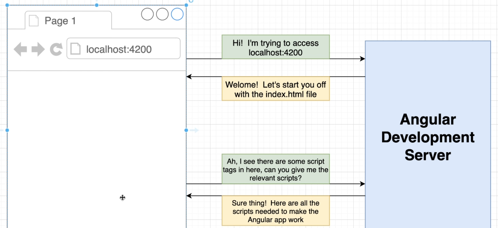
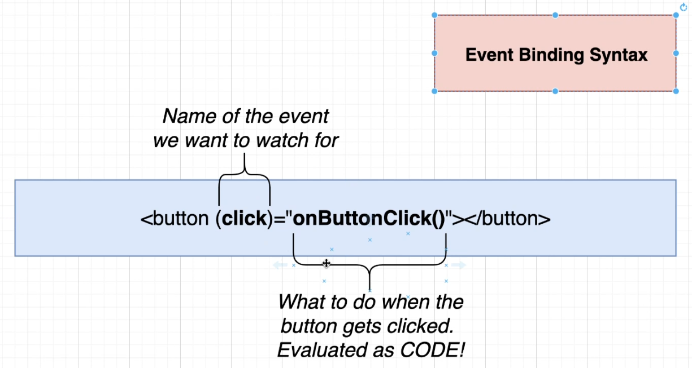
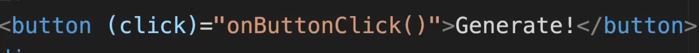
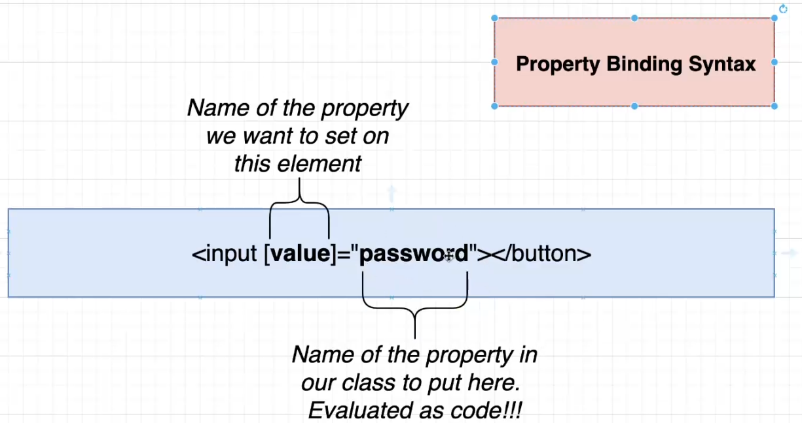
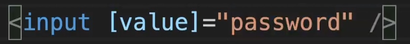
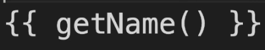
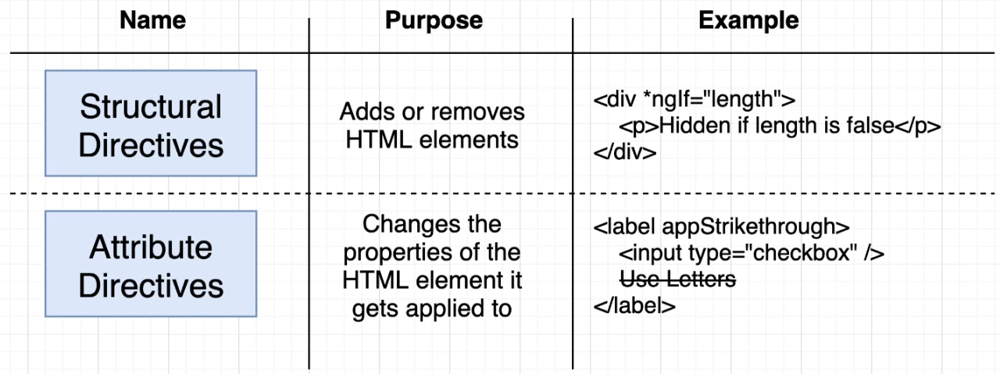

## Structure
| **Type**             | **Purpose**                                                                                           | **Example**                                                                 |
|----------------------|-------------------------------------------------------------------------------------------------------|------------------------------------------------------------------------------|
| Component Template   | Contains the HTML that gets displayed to a user                                                       | `app.component.html`                                                        |
| Component Class      | Contains code to run when important events occur (like when a user clicks a button)                   | `app.component.ts`                                                          |
| Property Binding     | Sets a property on an HTML element. Everything in the double quotes is code! Can access any property/method from our component class instance | `<button [disabled]="length">Submit</button>`              |
| Event Binding        | Sets up an event handler on an HTML element. Everything in the double quotes is code! Can call any method on the component class instance    | `<button (click)="onButtonClick()">Submit</button>`         |
| Interpolation        | Prints out information in a template. Can access any property/method from our component class instance | `
Your password length is {{ length }}
`            |
| Structural Directive | Changes the structure of HTML in a template.                                                          | `
Submit</button>
`       |

## Flow

## Event binding syntax

## Property binding syntax

## interpolation

## directives
