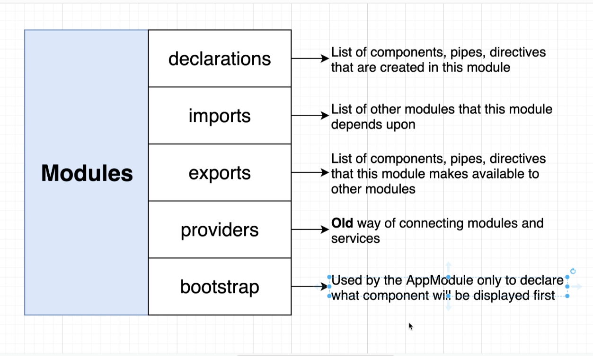

# Angular

## Start a new project
```bash
ng new <app name>
```

- enter for default answers
## start angular project
```bash
npm start 
# or
ng serve
```

- default port
` 4200 `
## generate component
```bash
ng generate component <name>
```

## generate pipe
```bash
ng generate pipe <name>
```

## generate directive
```bash
ng generate directive <name>
```

## generate application with routing included
```bash
ng new <app name> --routing
```

## generate modules for routed
```bash
ng g m <name> --routing
```

## generate component inside module
```bash
ng generate component elements/ElementsHome
```

## module property
