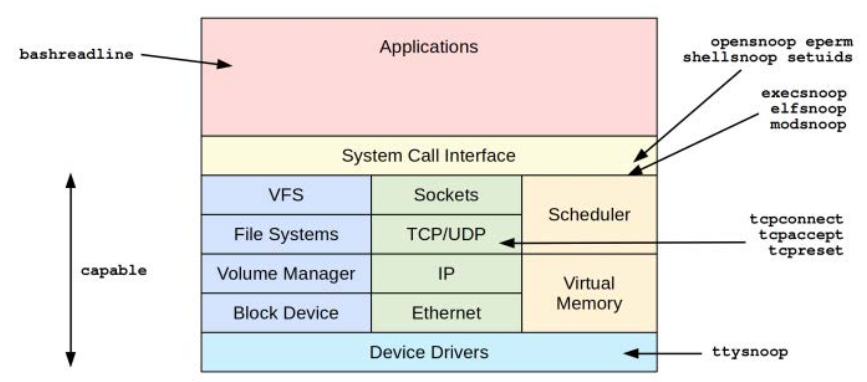

# Toolz



| Tool          | Source    | Target   | Description                                |
|---------------|-----------|----------|--------------------------------------------|
| execsnoop     | BCC/BT    | Syscalls | List new process execution                 |
| elfsnoop      | Book      | Kernel   | Show ELF file loads                        |
| modsnoop      | Book      | Kernel   | Show kernel module loads                   |
| bashreadline  | BCC/BT    | bash     | List entered bash shell commands           |
| shellsnoop    | Book      | shells   | Mirror shell output                        |
| ttysnoop      | BCC/book  | TTY      | Mirror tty output                          |
| opensnoop     | BCC/BT    | Syscalls | List files opened                          |
| eperm         | Book      | Syscalls | Count failed EPERM and EACCES syscalls     |
| tcpconnect    | BCC/BT    | TCP      | Trace outbound TCP connections (active)    |
| tcpaccept     | BCC/BT    | TCP      | Trace inbound TCP connections (passive)    |
| tcpreset      | Book      | TCP      | Show TCP send resets: port scan detection  |
| capable       | BCC/BT    | Security | Trace kernel security capability checks    |
| setuids       | Book      | Syscalls | Trace the setuid syscalls: privilege escalation |

## execsnoop
it is a BCC and bpftrace tool to trace new processes,
and can be used to identify suspicious process execution. Example output:
```bash
# execsnoop
PCOMM PID   PPID RET ARGS
ls    7777  21086 0 /bin/ls -F
a.out 7778  21086 0 /tmp/a.out
[...]
```
- PCOMM: Process name of the command being executed.
- PID: Process ID of the executing process.
- PPID: Parent Process ID from which the process is spawned.
- RET: Return code from the execve syscall (0 indicates success).
- ARGS: The command-line arguments passed to the process.

This shows a process executing from /tmp named a.out.
execsnoop works by tracing the execve syscall. This is a typical step in the creation of new
processes, which begins by calling fork or clone to create a new process and calls execve to
execute a different program. Note that this is not the only way new software can execute: a buffer
overflow attack can add new instructions to an existing process, and execute malicious software
without needing to call execve

## elfsnoop
traces the execution of ELF binaries by attaching to a key point in the kernel where all ELF executions must pass. This is typically done by instrumenting the kernel functions responsible for loading and executing ELF binaries.
elfsnoop works by tracing the load_elf_binary() function in the Linux kernel.
This function is responsible for loading ELF binaries into memory for execution.
By tracing this function, elfsnoop can capture every ELF binary execution event.


- TIME: Timestamp as HH:MM:SS.
- PID: Process ID.
- INTERPRETER: For scripts, the interpreter that was executed.
- FILE: Executed file.
- MOUNT: Mount point for the executed file.
- INODE: Index node number for the executed file: with the mount point, this forms a
unique identifier.
- RET: Return value from the attempted execution. 0 is success.

### Security Implications of elfsnoop
- Detection of Malicious Activity
elfsnoop can be a critical tool for identifying and mitigating malicious activity on a Linux system. It achieves this by providing detailed information about every ELF binary execution, which includes attributes that are difficult for attackers to spoof. Here’s a deeper look at how elfsnoop aids in security:

**Monitoring Executed Binaries**
- Real-Time Monitoring:

elfsnoop traces every execution of ELF binaries in real-time, allowing system administrators to observe all running processes as they happen.
This real-time insight is crucial for identifying and responding to suspicious activities promptly.

- Detailed Execution Logs:

By logging detailed information such as timestamp, process ID (PID), file path, mount point, inode number, interpreter, and return value, elfsnoop creates a comprehensive record of all executed binaries.
This log can be analyzed to detect unusual patterns or executions that deviate from the norm, which may indicate malicious activity.
Unique Mount Point and Inode Combination

**Mount Point**
The mount point indicates the file system location where the binary is stored.
Even if an attacker creates a malicious binary with the same name and path as a legitimate one, the mount point may differ, providing a clue that something is amiss.

**Inode Number**
An inode number is a unique identifier for a file within a file system.
Combining the mount point and inode number forms a unique identifier for the executed file.
An attacker would find it extremely difficult to match both the mount point and inode number of a legitimate system binary.
Examples of Malicious Activity Detection

**Spoofed System Binaries**

Attackers often replace system binaries (like /bin/ls or /usr/bin/ssh) with their own versions to gain unauthorized access or control.
elfsnoop can detect these replacements by logging the mount point and inode of the executed binary. If these details do not match the known, legitimate binaries, it signals a potential compromise.

- Unauthorized Script Executions:

Scripts executed with unauthorized interpreters (e.g., a script running with /bin/sh instead of /bin/bash) can be a sign of an attack.
elfsnoop logs the interpreter used for each script, making it easier to spot such deviations.

- Unusual Execution Locations:

Legitimate binaries are typically executed from standard directories like /bin, /usr/bin, etc.
Executions from unusual locations (e.g., /tmp, /var/tmp) can be indicative of malicious activities.
elfsnoop provides the file path and mount point, helping identify such anomalies.

Real-World Use Case
Imagine a scenario where an attacker has gained access to a Linux server and replaced /usr/bin/ssh with a malicious version:

Normal Execution:

Legitimate ssh:
Mount Point: /usr
Inode: 5678
When executed, elfsnoop logs:
```bash
TIME     PID   INTERPRETER   FILE   MOUNT     INODE    RET
14:22:15 1123  /usr/bin/ssh          /usr      5678     0
```
After Compromise:

Malicious ssh:
Mount Point: /tmp
Inode: 1234
When executed, elfsnoop logs:
```bash
TIME     PID   INTERPRETER   FILE                MOUNT     INODE    RET
14:45:30 2345                /usr/bin/ssh        /tmp      1234     0
```
Detection:

The administrator notices the unusual mount point /tmp and a different inode for ssh, indicating a potential security breach.


```bash
#!/usr/local/bin/bpftrace
#include <linux/binfmts.h>
#include <linux/fs.h>
#include <linux/mount.h>
BEGIN
{
printf("Tracing ELF loads. Ctrl-C to end\n");
printf("%-8s %-6s %-18s %-18s %-10s %-10s RET\n",
"TIME", "PID", "INTERPRETER", "FILE", "MOUNT", "INODE");
}
```
kprobe:load_elf_binary #Sets a kernel probe (kprobe) on the load_elf_binary function, which is responsible for loading ELF binaries.
{
@arg0[tid] = arg0; #Stores the first argument (arg0) of the function call in a BPF map using the thread ID (tid) as the key.

}
```
kretprobe:load_elf_binary # Sets a return probe (kretprobe) on the load_elf_binary function, which triggers when the function returns.

/@arg0[tid]/ # The conditional (/@arg0[tid]/) ensures this block runs only if there is an entry for the current thread ID in the @arg0 map.
{
$bin = (struct linux_binprm *)@arg0[tid]; # Casts the stored arg0 value to a struct linux_binprm pointer to access the ELF binary's properties.
time("%H:%M:%S ");
printf("%-6d %-18s %-18s %-10s %-10d %3d\n", pid,
str($bin->interp), str($bin->filename),
str($bin->file->f_path.mnt->mnt_root->d_name.name),
$bin->file->f_inode->i_ino, retval);
# Output Columns
# TIME: The current time in "HH:MM
# " format.
# PID: The process ID of the process loading the ELF binary.
# INTERPRETER: The ELF interpreter path.
# FILE: The path of the ELF file being loaded.
# MOUNT: The root name of the mount point.
# INODE: The inode number of the ELF file.
# RET: The return value of the load_elf_binary function.
delete(@arg0[tid]); # Deletes the entry for the current thread ID from the @arg0 map to clean up.
}
```
```
**Summary**
elfsnoop enhances security by providing a detailed, real-time audit trail of all executed ELF binaries. By leveraging the unique combination of mount points and inode numbers, elfsnoop makes it significantly harder for attackers to disguise their activities. This tool is invaluable for detecting unauthorized modifications, unusual execution patterns, and potential security breaches, thereby helping maintain the integrity and security of a Linux system.

## modsnoop
modsnoop5 is a bpftrace tool to show kernel module loads. For example:
```bash
# modsnoop.bt
Attaching 2 probes...
Tracing kernel module loads. Hit Ctrl-C to end.
12:51:38 module init: msr, by modprobe (PID 32574, user root, UID 0)
[...]
```
This shows that at 10:50:26 the "msr" module was loaded by the modprobe tool, with UID 0.
‍‍‍- Script
```bash
#!/usr/local/bin/bpftrace
#include <linux/module.h>
BEGIN
{
printf("Tracing kernel module loads. Hit Ctrl-C to end.\n");
}
```
kprobe:do_init_module
{
$mod = (struct module *)arg0;
time("%H:%M:%S ");
printf("module init: %s, by %s (PID %d, user %s, UID %d)\n",
$mod->name, comm, pid, username, uid);
}
```
```
This works by tracing the do_init_module() kernel function, which can access details from the
module struct.
There is also a module:module_load tracepoint, used by later one-liners

## bashreadline
bashreadline is a BCC and bpftrace tool to trace interactively entered commands in the bash
shell, system-wide. For example, running the BCC version:
```bash
# bashreadline
bashreadline
TIME PID COMMAND
11:43:51 21086 ls
11:44:07 21086 echo hello book readers
11:44:22 21086 eccho hi
11:44:33 21086 /tmp/ls
[...]
```
This output shows commands that were entered while tracing, including shell built-ins (echo)
and commands that failed (eccho). This works by tracing the readline() function from the bash shell, 
so any entered command will be shown. Note that while this can trace commands across all
shells running on the system, it cannot trace commands by other shell programs, and an attacker
may install their own shell (e.g., a nanoshell) that is not traced.

bpftrace script
```bash
#!/usr/local/bin/bpftrace
BEGIN
{
printf("Tracing bash commands... Hit Ctrl-C to end.\n");
printf("%-9s %-6s %s\n", "TIME", "PID", "COMMAND");
}
```
uretprobe:/bin/bash:readline
{
time("%H:%M:%S
");
printf("%-6d %s\n", pid, str(retval));
}
```
```
This traces the readline() function in /bin/bash using a uretprobe.
Some Linux distributions build bash differently 
such that readline() is used from the libreadline library instead;


## shellsnoop
Shellsnoop is an eBPF-based tool designed for monitoring and logging shell commands executed on a system. 
It operates by attaching eBPF programs to specific system calls, such as execve, which are used to execute programs.

**Key Features of Shellsnoop**
- Monitors Executed Commands: Captures details of shell commands at the point of execution, providing insight into the commands run on a system.
- System-Wide Scope: Capable of monitoring commands from any shell or executable, not limited to a specific shell like bash.
- Efficient Operation: Utilizes eBPF technology to run lightweight programs in kernel space, ensuring minimal performance overhead.
- Detailed Logging: Logs information such as the command executed, user ID, process ID, and other relevant metadata, useful for auditing and security monitoring.
- Security and Compliance: Helps in auditing user activities, detecting unauthorized or suspicious behavior, and ensuring compliance with security policies.

**Use Cases**
- Security Monitoring: Tracks executed commands to detect potential security breaches or unauthorized actions.
- Auditing: Provides a log of executed commands for post-incident analysis and compliance verification.
- Intrusion Detection: Identifies unusual or malicious command executions to help in preventing security incidents.

Example Usage:

```bash
sudo shellsnoop
```


```bash
#!/usr/local/bin/bpftrace   Purpose: Specifies the path to the BPFtrace interpreter, which will execute this script.
BEGIN # This block runs at the start of the script execution.
/$1 == 0/ # checks if no PID argument is provided (i.e., if $1 is zero or not set).
{
printf("USAGE: shellsnoop.bt PID\n"); # prints usage information to indicate how to use the script.
exit(); # exits the script if no PID is provided.
}
tracepoint:sched:sched_process_fork # This tracepoint triggers on the fork system call, which is used to create new processes.
/args->parent_pid == $1 || @descendent[args->parent_pid]/
# args->parent_pid == $1: Checks if the parent PID of the new process matches the PID provided to the script.
# @descendent[args->parent_pid]: Checks if the parent PID is already marked as a descendant.
{
@descendent[args->child_pid] = 1;
#Marks the child PID as a descendant by adding it to the @descendent associative array. This array tracks the PIDs of all descendant processes.
# Trace Writes to STDOUT and STDERR
# bpftrace
}
tracepoint:syscalls:sys_enter_write # This tracepoint triggers on the write system call, which is used to write data to file descriptors.
/(pid == $1 || @descendent[pid]) && (args->fd == 1 || args->fd == 2)/ 
# Checks if the current process PID matches the provided PID or is a descendant.
# Checks if the file descriptor is either 1 (STDOUT) or 2 (STDERR).
{
printf("%s", str(args->buf, args->count));
# Prints the data being written to STDOUT or STDERR. str(args->buf, args->count) converts the buffer being written into a string, truncated to BPFTRACE_STRLEN (64 bytes by default).
```

**Summary of code**
Initialization: The script begins by checking if a PID is provided. If not, it prints usage information and exits.
Fork Monitoring: It tracks when processes fork (create child processes) and marks these child processes as descendants of the original PID.
Output Logging: It monitors write system calls from the specified process and its descendants, capturing and printing data written to STDOUT and STDERR.


## ttysnoop
traces terminal sessions live by tracing tty_write() kernel function

* tty_write : in the Linux kernel is responsible for writing data to a terminal. By tracing this function, you can capture all data being written to any terminal device.

* tty: Refers to physical or virtual terminals directly connected to the system. They are lower-level and used for direct system interaction.
  * tty devices are represented in the filesystem under /dev/tty*.
  Examples include /dev/tty1, /dev/tty2, etc.
  * pts: Refers to pseudo-terminal devices created by terminal emulators and remote access tools. They facilitate terminal sessions in graphical environments and remote connections.
  * pts devices are represented in the filesystem under /dev/pts/*.
  * Examples include /dev/pts/0, /dev/pts/1, etc.
  * Components of PTYs:
    * Master: The controlling side of the PTY, usually accessed by a program.
    * Slave: The emulated terminal side of the PTY, which appears as a pts device like shell.
  * Usage:
    * Used by terminal emulators to provide interactive shells in graphical environments.
    * SSH sessions and other remote terminal access methods create pts devices for each session.

* `ls /dev/pts` : all terminal sessions
* `ttl` : session number for current terminal 
  
```bash
ttysnoop [options] device
```
Options include:
-C: Don’t clear the screen
> The device is either a full path to a pseudo terminal, e.g., /dev/pts/2, or just the number 2

### script
The following is the code for the bpftrace version:
```bash
#!/usr/local/bin/bpftrace
#include <linux/fs.h>
BEGIN
{
if ($1 == 0) {
printf("USAGE: ttysnoop.bt pts_device
# eg, pts14\n");
exit();
}
```
printf("Tracing tty writes. Ctrl-C to end.\n");
}
```
kprobe:tty_write
{
$file = (struct file *)arg0;
// +3 skips "pts":
if (str($file->f_path.dentry->d_name.name) == str($1 + 3)) {
printf("%s", str(arg1, arg2));
}
```
}
```
# The kprobe:tty_write block attaches a probe to the tty_write kernel function.
# arg0 is the first argument to the tty_write function, which is a pointer to a struct file representing the file being written to.
# $file = (struct file *)arg0 casts arg0 to a struct file *.
# if (str($file->f_path.dentry->d_name.name) == str($1 + 3)) compares the name of the file being written to with the provided pts device name. The +3 skips the "pts" part of the device name.
# If the condition is true, it prints the data being written to the terminal using printf("%s", str(arg1, arg2)). Here, arg1 and arg2 are arguments to the tty_write function, representing the data being written and its length, respectively.
```

## opensnoop
it is a BCC and bpftrace tool to trace file opens, which can be used for a number of security tasks, such as understanding
malware behavior and monitoring file usage. Example output from the BCC version:
```bash
# opensnoop
PID COMM FD ERR PATH
12748 opensnoop -12 /usr/lib/python2.7/encodings/ascii.x86_64-linux-gnu.so
12748 opensnoop -12 /usr/lib/python2.7/encodings/ascii.so
12748 opensnoop -12 /usr/lib/python2.7/encodings/asciimodule.so
12748 opensnoop 18 0 /usr/lib/python2.7/encodings/ascii.py
12748 opensnoopv 19 0 /usr/lib/python2.7/encodings/ascii.pyc
1222 polkitd 11 0 /etc/passwd
1222 polkitd 11 0 /proc/11881/status
1222 polkitd 11 0 /proc/11881/stat
1222 polkitd 11 0 /etc/passwd
1222 polkitd 11 0 /proc/11881/status
1222 polkitd 11 0 /proc/11881/stat
1222 polkitd 11 0 /proc/11881/cgroup
1222 polkitd 11 0 /proc/1/cgroup
1222 polkitd 11 0 /run/systemd/sessions/2
[...]
```
This output shows opensnoop searching for and then loading an ascii python module: the
first three opens were unsuccessful. Then polkitd (PolicyKit daemon) is caught opening the
passwd file and checking process statuses. opensnoop works by tracing the open variety
of syscalls.

## eperm
eperm is a bpftrace tool to count syscalls that failed with either EPERM “operation not
permitted” or EACCES “permission denied” errors, both of which may be interesting for security
analysis. For example:
```bash
# eperm.bt
Attaching 3 probes...
Tracing EACCESS and EPERM syscall errors. Ctrl-C to end.
^C
@EACCESS[systemd-logind, sys_setsockopt]: 1
@EPERM[cat, sys_openat]: 1
@EPERM[gmain, sys_inotify_add_watch]: 6
```

This shows the process name and the syscall that failed, grouped by failure. For example, this
output shows there was one EPERM failure by cat(1) for the openat syscall. These failures can
be further investigated using other tools, such as opensnoop for open failures.
This works by tracing the raw_syscalls:sys_exit tracepoint, which fires for all syscalls. The
overhead may begin to be noticeable on systems with high I/O rates; you should test in a lab
environment.

### script
```bash
#!/usr/local/bin/bpftrace
BEGIN
{
printf("Tracing EACCESS and EPERM syscall errors. Ctrl-C to end.\n");
}
```
tracepoint:raw_syscalls:sys_exit
/args->ret == -1/
{
@EACCESS[comm, ksym(*(kaddr("sys_call_table") + args->id * 8))] =
count();
}
```
tracepoint:raw_syscalls:sys_exit
/args->ret == -13/
{
@EPERM[comm, ksym(*(kaddr("sys_call_table") + args->id * 8))] =
count();
}
```
```
**explanation**
The raw_syscalls:sys_exit tracepoint provides only an identification number for the syscall. To
convert this to a name, a lookup table of syscalls can be used, which is how the BCC syscount
tool does it. eperm uses a different technique: the kernel system call table (sys_call_table) is
read, finding the function that handles the syscall, and then it converts that function address to
the kernel symbol name.

## tcpconnect and tcpaccept
they are BCC and bpftrace tools to trace new TCP connections, and can be used to identify suspicious network activity. Many types
of attacks involve connecting to a system at least once. Example output from BCC tcpconnect:
# tcpconnect
‍‍‍```bash
PID COMM IP SADDR DADDRD PORT
22411 a.out 4 10.43.1.178 10.0.0.1 8080
[...]
```
The tcpconnect output shows an a.out process making a connection to 10.0.0.1 port 8080,
which sounds suspicious. (a.out is a default filename from some compilers and is not normally
used by any installed software.)

Example output from BCC tcpaccept, also using the -t option to print timestamps:
```bash
# tcpaccept -t
TIME(s)PIDCOMMIP RADDRLADDRLPORT
0.0001440sshd410.10.1.20110.43.1.17822
0.2011440sshd410.10.1.20110.43.1.17822
0.4081440sshd410.10.1.20110.43.1.17822
0.6121440sshd410.10.1.20110.43.1.17822
[...]
```
This output shows multiple connections from 10.10.1.201 to port 22, served by sshd. These are
happening about every 200 milliseconds (from the "TIME(s)" column), which could be a brute-
force attack.
A key feature of these tools is that, for efficiency, they instrument only TCP session events. Other
tools trace every network packet, which can incur high overhead on busy systems.

## tcpreset

tcpreset is a bpftrace tool to trace when TCP sends reset (RST) packets. This can be used for the
detection of TCP port scanning, which sends packets to a range of ports, including closed ones,
triggering RSTs in response. For example:
```bash
# tcpreset.bt
Attaching 2 probes...
Tracing TCP resets. Hit Ctrl-C to end.
TIME LADDR LPORT RADDR RPORT
20:50:24 100.66.115.238 80 100.65.2.19645195
20:50:24 100.66.115.238 443 100.65.2.19645195
20:50:24 100.66.115.238 995 100.65.2.19645451
20:50:24 100.66.115.238 5900 100.65.2.19645451
20:50:24 100.66.115.238 443 100.65.2.19645451
20:50:24 100.66.115.238 110 100.65.2.19645451
20:50:24 100.66.115.238 135 100.65.2.19645451
20:50:24 100.66.115.238 256 100.65.2.19645451
20:50:24 100.66.115.238 21 100.65.2.19645451
20:50:24 100.66.115.238 993 100.65.2.19645451
20:50:24 100.66.115.238 3306 100.65.2.19645451
20:50:24 100.66.115.238 25 100.65.2.19645451
20:50:24 100.66.115.238 113 100.65.2.19645451
20:50:24 100.66.115.238 1025 100.65.2.19645451
20:50:24 100.66.115.238 18581 100.65.2.19645451
20:50:24 100.66.115.238 199 100.65.2.19645451
20:50:24 100.66.115.238 56666 100.65.2.19645451
20:50:24 100.66.115.238 8080 100.65.2.19645451
20:50:24 100.66.115.238 53 100.65.2.19645451
20:50:24 100.66.115.238 587 100.65.2.19645451
[...]
```
This shows many TCP RSTs were sent for different local ports within the same second: this looks
like a port scan. It works by tracing the kernel function that sends resets, and the overhead should
therefore be negligible, as this occurs infrequently in normal operation.
Note that there are different types of TCP port scans, and TCP/IP stacks can respond to them
differently. I tested a Linux 4.15 kernel using the nmap(1) port scanner, and it responded with
RSTs to SYN, FIN, NULL, and Xmas scans, making them all visible using tcpreset.
The columns are:
- TIME: Time in HH:MM:SS format
- LADDR: Local address
- LPORT: Local TCP port
- RADDR: Remote IP address
- RPORT: Remote TCP port

### Script

The source to tcpreset is:
```bash
#!/usr/local/bin/bpftrace
#include <net/sock.h>
#include <uapi/linux/tcp.h>
#include <uapi/linux/ip.h>
BEGIN
{
printf("Tracing TCP resets. Hit Ctrl-C to end.\n");
printf("%-8s %-14s %-6s %-14s %-6s\n", "TIME",
"LADDR", "LPORT", "RADDR", "RPORT");
}
kprobe:tcp_v4_send_reset
{
$skb = (struct sk_buff *)arg1;
$tcp = (struct tcphdr *)($skb->head + $skb->transport_header);
$ip = (struct iphdr *)($skb->head + $skb->network_header);
$dport = ($tcp->dest >> 8) | (($tcp->dest << 8) & 0xff00);
$sport = ($tcp->source >> 8) | (($tcp->source << 8) & 0xff00);
time("%H:%M:%S ");
printf("%-14s %-6d %-14s %-6d\n", ntop(AF_INET, $ip->daddr), $dport,
ntop(AF_INET, $ip->saddr), $sport);
}
```

This traces the tcp_v4_send_reset() kernel function, which only traces IPv4 traffic. The tool can be
enhanced to trace IPv6 as well if desired.
This tool is also an example of reading IP and TCP headers from a socket buffer: the lines that set
$tcp and $ip. This logic is based on the kernel’s ip_hdr() and tcp_hdr() functions, and will need
updates if the kernel changes this logic.


## capable
### BCC
Command line usage:
capable [options]
Options include:
- -v: Include non-audit checks (verbose)
- -p PID: Measure this process only
- -K: Include kernel stack traces
- -U: Include user-level stack traces
Some checks are considered “non-audit” and don’t write a message to the audit log. These are
excluded by default unless -v is used.

### bpftrace
The following is the code for the bpftrace version, which summarizes its core functionality. This
version does not support options and traces all capability checks, included non-audit.

The capable tool written in bpftrace traces all capability checks made by the kernel. Here is a detailed breakdown of its code and functionality:

Overview
The bpftrace version of the capable tool does not support options and traces all capability checks, including non-audit checks. It prints information about each capability check performed by the kernel.

#### Code Explanation
```bash
#!/usr/local/bin/bpftrace

BEGIN
{
    printf("Tracing cap_capable syscalls... Hit Ctrl-C to end.\n");
    printf("%-9s %-6s %-6s %-16s %-4s %-20s AUDIT\n", "TIME", "UID", "PID", "COMM", "CAP", "NAME");

    @cap[0] = "CAP_CHOWN";
    @cap[1] = "CAP_DAC_OVERRIDE";
    @cap[2] = "CAP_DAC_READ_SEARCH";
    @cap[3] = "CAP_FOWNER";
    @cap[4] = "CAP_FSETID";
    @cap[5] = "CAP_KILL";
    @cap[6] = "CAP_SETGID";
    @cap[7] = "CAP_SETUID";
    @cap[8] = "CAP_SETPCAP";
    @cap[9] = "CAP_LINUX_IMMUTABLE";
    @cap[10] = "CAP_NET_BIND_SERVICE";
    @cap[11] = "CAP_NET_BROADCAST";
    @cap[12] = "CAP_NET_ADMIN";
    @cap[13] = "CAP_NET_RAW";
    @cap[14] = "CAP_IPC_LOCK";
    @cap[15] = "CAP_IPC_OWNER";
    @cap[16] = "CAP_SYS_MODULE";
    @cap[17] = "CAP_SYS_RAWIO";
    @cap[18] = "CAP_SYS_CHROOT";
    @cap[19] = "CAP_SYS_PTRACE";
    @cap[20] = "CAP_SYS_PACCT";
    @cap[21] = "CAP_SYS_ADMIN";
    @cap[22] = "CAP_SYS_BOOT";
    @cap[23] = "CAP_SYS_NICE";
    @cap[24] = "CAP_SYS_RESOURCE";
    @cap[25] = "CAP_SYS_TIME";
    @cap[26] = "CAP_SYS_TTY_CONFIG";
    @cap[27] = "CAP_MKNOD";
    @cap[28] = "CAP_LEASE";
    @cap[29] = "CAP_AUDIT_WRITE";
    @cap[30] = "CAP_AUDIT_CONTROL";
    @cap[31] = "CAP_SETFCAP";
    @cap[32] = "CAP_MAC_OVERRIDE";
    @cap[33] = "CAP_MAC_ADMIN";
    @cap[34] = "CAP_SYSLOG";
    @cap[35] = "CAP_WAKE_ALARM";
    @cap[36] = "CAP_BLOCK_SUSPEND";
    @cap[37] = "CAP_AUDIT_READ";
}
```

kprobe:cap_capable
{
    $cap = arg2;
    $audit = arg3;
    time("%H:%M:%S ");
    printf("%-6d %-6d %-16s %-4d %-20s %d\n", uid, pid, comm, $cap, @cap[$cap], $audit);
}
```

END
{
    clear(@cap);
}
```
```

**Detailed Breakdown**
- BEGIN Block
Purpose: This block is executed once when the script starts.
Actions:
Prints a header message indicating the start of tracing.
Prints column headers for the output.
Initializes an associative array @cap that maps capability numbers to their names. This is used for lookup during the capability checks.
- Capability Mapping
```bash
@cap[0] = "CAP_CHOWN";
@cap[1] = "CAP_DAC_OVERRIDE";
# ... other capabilities ...
@cap[37] = "CAP_AUDIT_READ";
```
This mapping helps translate capability numbers to human-readable names. Each capability in Linux has a unique number, and this array maps those numbers to their respective capability names.
- kprobe
Purpose: This block is executed each time the cap_capable kernel function is called.
Actions:
Captures the capability being checked (arg2), which is stored in the variable $cap.
Captures the audit flag (arg3), stored in the variable $audit.
Prints the current time, user ID (uid), process ID (pid), command name (comm), capability number ($cap), capability name (@cap[$cap]), and the audit flag ($audit).

Example Output:

objectivec
```bash
TIME      UID    PID    COMM             CAP  NAME                  AUDIT
12:00:37  1000   26069  bash             2    CAP_DAC_READ_SEARCH   1
```
This line shows that at 12:00:37, a capability check for CAP_DAC_READ_SEARCH (capability number 2) was performed by the process bash (PID 26069) running with UID 1000. The AUDIT column indicates whether this check is recorded in the audit log (1 for yes, 0 for no).

- END Block
Purpose: This block is executed once when the script ends.
Actions:
Clears the @cap array. This is a cleanup step to free any resources used by the array.

**Summary**
The capable tool in bpftrace provides a way to trace and log all capability checks made by the kernel, including non-audit checks. It displays information such as the time of the check, the user and process IDs, the command making the check, the capability number and name, and whether the check is audited.

## setuids
setuids is a bpftrace tool to trace privilege escalation syscalls: setuid, setresuid, and
setfsuid. For example:
```bash
# setuids.bt# setuids.bt
Attaching 7 probes...
Tracing setuid family syscalls. Hit Ctrl-C to end.
TIME        PID   COMM   UID    SYSCALL       ARGS                                (RET)
23:39:18    23436 sudo   1000   setresuid     ruid=-1 euid=1000 suid=-1           (0)
23:39:18    23436 sudo   1000   setresuid     ruid=-1 euid=0 suid=-1              (0)
23:39:18    23436 sudo   1000   setresuid     ruid=-1 euid=0 suid=-1              (0)
23:39:18    23436 sudo   1000   setresuid     ruid=0 euid=-1 suid=-1              (0)
23:39:18    23436 sudo   0      setresuid     ruid=1000 euid=-1 suid=-1           (0)
23:39:18    23436 sudo   1000   setresuid     ruid=-1 euid=-1 suid=-1             (0)
23:39:18    23436 sudo   1000   setuid        uid=0                               (0)
23:39:18    23437 sudo   0      setresuid     ruid=0 euid=0 suid=0                (0)
[...]
```
This shows a sudo command that was changing a UID from 1000 to 0 and the various syscalls it
used to do this. Logins via sshd can also be seen via setuids, as they also change the UID.
The columns include:
- UID: The user ID before the setuid call.
- SYSCALL: The syscall name.
- ARGS: Arguments to the syscall.
- (RET): Return value. For setuid and setresuid, this shows whether the call was
successful. For setfsuid, it shows the previous UID.
This works by instrumenting the tracepoints for these syscalls. Since the rate of these syscalls
should be low, the overhead of this tool should be negligible.

### script

The provided source code for the setuids tool is a script written in bpftrace, which uses BPF (Berkeley Packet Filter) technology to trace specific syscalls related to user ID changes in a Unix-like operating system. Here is a detailed breakdown of the script:

- Script Header
```bash
#!/usr/local/bin/bpftrace
```
This line specifies the interpreter for the script, which is bpftrace.

- BEGIN Block
```bash
BEGIN
{
    printf("Tracing setuid(2) family syscalls. Hit Ctrl-C to end.\n");
    printf("%-8s %-6s %-16s %-6s %-9s %s\n", "TIME", "PID", "COMM", "UID", "SYSCALL", "ARGS (RET)");
}
```
The BEGIN block runs once when the script starts.
It prints a header message indicating that tracing has started.
It prints column headers for the output format: TIME, PID, COMM, UID, SYSCALL, and ARGS (RET).

- Tracepoint: sys_enter_setuid and sys_enter_setfsuid
```bash
tracepoint:syscalls:sys_enter_setuid,
tracepoint:syscalls:sys_enter_setfsuid
{
    @uid[tid] = uid;
    @setuid[tid] = args->uid;
    @seen[tid] = 1;
}
```
These blocks handle entry tracepoints for setuid and setfsuid syscalls.
When these syscalls are entered, the script stores the current UID in a map @uid indexed by thread ID (tid).
The target UID (args->uid) is stored in a map @setuid.
A flag @seen is set to indicate that these syscalls have been encountered for the current thread.

- Tracepoint: sys_enter_setresuid
```bash
tracepoint:syscalls:sys_enter_setresuid
{
    @uid[tid] = uid;
    @ruid[tid] = args->ruid;
    @euid[tid] = args->euid;
    @suid[tid] = args->suid;
    @seen[tid] = 1;
}
```
This block handles the entry tracepoint for the setresuid syscall.
It stores the current UID, real UID (args->ruid), effective UID (args->euid), and saved set-user-ID (args->suid) in maps indexed by thread ID.
A flag @seen is set to indicate that this syscall has been encountered for the current thread.

- Tracepoint: sys_exit_setuid
```bash
tracepoint:syscalls:sys_exit_setuid
/@seen[tid]/
{
    time("%H:%M:%S ");
    printf("%-6d %-16s %-6d setuid uid=%d (%d)\n", pid, comm, @uid[tid], @setuid[tid], args->ret);
    delete(@seen[tid]);
    delete(@uid[tid]);
    delete(@setuid[tid]);
}
```
This block handles the exit tracepoint for the setuid syscall.
If the @seen flag is set for the current thread, it means this syscall was previously encountered.
It prints the time, process ID (pid), command name (comm), current UID, target UID, and the return value (args->ret).
The script then deletes the entries in the maps for this thread ID to clean up.

- Tracepoint: sys_exit_setfsuid
```bash
tracepoint:syscalls:sys_exit_setfsuid
/@seen[tid]/
{
    time("%H:%M:%S ");
    printf("%-6d %-16s %-6d setfsuid uid=%d (prevuid=%d)\n", pid, comm, @uid[tid], @setuid[tid], args->ret);
    delete(@seen[tid]);
    delete(@uid[tid]);
    delete(@setuid[tid]);
}
```
This block handles the exit tracepoint for the setfsuid syscall.
If the @seen flag is set for the current thread, it prints similar details as above but includes the previous UID before the change.
The script then deletes the entries in the maps for this thread ID.

- Tracepoint: sys_exit_setresuid
```bash
tracepoint:syscalls:sys_exit_setresuid
/@seen[tid]/
{
    time("%H:%M:%S ");
    printf("%-6d %-16s %-6d setresuid ", pid, comm, @uid[tid]);
    printf("ruid=%d euid=%d suid=%d (%d)\n", @ruid[tid], @euid[tid], @suid[tid], args->ret);
    delete(@seen[tid]);
    delete(@uid[tid]);
    delete(@ruid[tid]);
    delete(@euid[tid]);
    delete(@suid[tid]);
}
```
This block handles the exit tracepoint for the setresuid syscall.
If the @seen flag is set for the current thread, it prints the details of the syscall, including the real UID, effective UID, saved set-user-ID, and the return value.
The script then deletes the entries in the maps for this thread ID.


