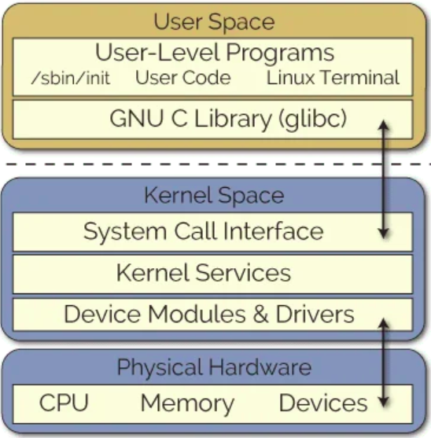
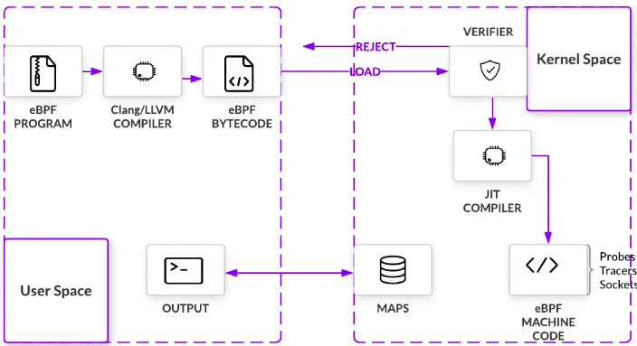

# BPF

**In HIS name**


eBPF is a mechanism for Linux applications to execute code in Linux kernel space. eBPF has already been used to create programs for networking, debugging, tracing, firewalls, and more
eBPF can run sandboxed programs in the Linux kernel without changing kernel source code or loading kernel modules
eBPF lets programmers execute custom bytecode within the kernel without having to change the kernel or load kernel modules



## LKM - Linux Kernel Modules
While the system call interface is sufficient in most cases, developers may need more flexibility to add support for new hardware, implement new filesystems, or even custom system calls. For this to be possible, there must be a way for programmers to extend the base kernel without adding directly to the kernel source code.

>System calls -> requests traverse from user space to kernel space
>LKM-> loaded directly into the kernel,they can be loaded at runtime. removing the need to recompile the entire kernel and reboot the machine each time a new kernel module is required

## eBFP
eBPF allows regular userspace applications to package the logic to be executed within the Linux kernel as a bytecode. These are called eBPF programs and they are produced by eBPF compiler toolchain called BCC. eBPF programs are invoked by the kernel when certain events, called hooks, happen. Examples of such hooks include system calls, network events, and others.

Before being loaded into the kernel, an eBPF program must pass a certain set of checks. Verification involves executing the eBPF program within a virtual machine. Doing so allows the verifier, with 10,000+ lines of code, to perform a series of checks. The verifier will traverse the potential paths the eBPF program may take when executed in the kernel, making sure the program does indeed run to completion without any looping, which would cause a kernel lockup. Other checks, from valid register state and program size to out of bound jumps, are also carried through. 
From the outset, eBPF sets itself apart from LKMs with important safety controls in place. Only if all checks pass, the eBPFprogram is loaded and compiled into the kernel and starts waiting for the right hook. Once triggered, the bytecode executes.
The end result is that eBPF lets programmers safely execute custom bytecode within the Linux kernel without modifying or adding to kernel source code. While still a far cry from replacing LKMs as a whole, eBPF programs introduce custom code to interact with protected hardware resources with minimal risk for the kernel.

## Events and Hooking
As we have already covered, eBPF programs execute in an event-driven environment. They are triggered by kernel hooks. The diversity of hook locations is one of the many aspects that makes eBPF so useful. A quick sampling of these include:

System Calls - Inserted when user space functions transfer execution to the kernel
Function Entry and Exit - Intercepts calls to pre-existing functions
Network Events - Executes when packets are received
Kprobes and uprobes - Attach to probes for kernel or user functions


## Helper Functions
When eBPF programs are triggered at their hook points, they can call helper functions. These special functions are what makes eBPF feature-rich. For example, helpers can perform a wide variety of tasks:

Search, update, and delete key-value pairs in tables
Generate a pseudo-random number
Collect and flag tunnel metadata
Chain eBPF programs together, known as tail calls
Perform tasks with sockets, like binding, retrieve cookies, redirect packets, etc.
These helper functions must be defined by the kernel, meaning there is a whitelist of calls eBPF programs can make. But their number is large and continues to grow.


## eBPF Maps
eBPF maps allow eBPF programs to keep state between invocations and to share data with the user-space applications. An eBPF map is basically a key-value store, where values are generally treated as binary blobs of arbitrary data. 

They are created using the `bpf_cmd` syscall with BPF_MAP_CREATE parameter and, as everything else in the Linux world, they are addressed via a file descriptor. Interacting with a map happens through lookup/update/delete syscalls

   eBPF maps
       Maps are a generic data structure for storage of different types
       of data.  They allow sharing of data between eBPF kernel
       programs, and also between kernel and user-space applications.
       Each map type has the following attributes:
       •  type
       •  maximum number of elements
       •  key size in bytes
       •  value size in bytes

## Executing an eBPF Program
Building eBPF Programs
The kernel expects all eBPF programs to be loaded as bytecode, so we need a way to create the bytecode using higher-level languages. The most popular toolchain for writing and debugging eBPF programs is called BPF Compiler Collection (BCC) and it is based on LLVM and CLang. 

Just-In-Time (JIT) Compiler
After verification, eBPF bytecode is just-in-time (JIT) compiled into native machine code. eBPF has a modern design, meaning it has been upgraded to be 64-bit encoded with 11 total registers. This closely maps eBPF to hardware for x86_64, ARM, and arm64 architecture, amongst others. Fast compilation at runtime makes it possible for eBPF to remain performant even as it must first pass through a VM.



eBPF (extended Berkeley Packet Filter) bytecode passes through the eBPF virtual machine (VM) during its execution. The eBPF VM is an in-kernel virtual machine that verifies and interprets eBPF bytecode. 

The important takeaway here is understanding that eBPF unlocks access to kernel level events without the typical restrictions found when changing kernel code directly. 

**Summarizing**, eBPF works by:
 
* Compiling eBPF programs into bytecode
* Verifying programs execute safely in a VM before being being loaded at the hook point
* Attaching programs to hook points within the kernel that are triggered by specified events
* Compiling at runtime for maximum efficiency
* Calling helper functions to manipulate data when a program is triggered
* Using maps (key-value pairs) to share data between the user space and kernel space and for keeping state.


## eBPF in Action
Teleport is an open source multi-protocol identity-aware access proxy. It provides a convenient and secure way of accessing SSH servers, Kubernetes clusters, databases and other resources behind NAT, think cloud-native replacement for OpenSSH.

One of the project goals was to provide the detailed audit log of what actually happens during SSH sessions. To achieve that, Teleport logs the following data:

Bytestreams of interactive sessions, so they can be replayed in a Youtube-like web interface.
JSON audit log of structured events.
The interactive sessions can show what a user was typing in her terminal during an interactive session. Let’s say she executed a bash script and the recording will show this. But the recording will not show if any file system changes took place, or whether the script downloaded or uploaded any data to/from this machine. 

That’s what the JSON event log is for, and Teleport uses eBPF to “spy” on user’s actions during interactive SSH sessions. Consider, for example, the command:

echo Y3VybCBodHRwOi8vd3d3LmV4YW1wbGUuY29tCg== | base64 --decode | sh
Even though we can capture this command as printed out in the terminal, it means nothing to us as the user has obfuscated the command that is piped into sh by encoding it in base64. But by looking into the JSON log, we learn the user was attempting to obfuscate curl:

The power of eBPF flows from two advantages: it's **fast and it's safe**


```json

{
  "event": "session.command",
  "path": "/bin/sh",
  "program": "sh",
  "argv": [],
  "login": "centos",
  "user": "jsmith"
}
{
  "event": "session.command",
  "path": "/bin/base64",
  "program": "base64",
  "argv": [
    "--decode"
  ],
  "login": "centos",
  "user": "jsmith"
}
{
  "event": "session.command",
  "path": "/bin/curl",
    "argv": [
    "http://www.example.com"
  ],
  "program": "curl",
  "return_code": 0,
  "login": "centos",
  "user": "jsmith"
}
{
  "event": "session.network",
  "program": "curl",
  "src_addr": "172.31.43.104",
  "dst_addr": "93.184.216.34",
  "dst_port": 80,
  "login": "centos",
  "user": "jsmith",
  "version": 4
}
```

How did Teleport collect these events? By installing eBPF hooks at the beginning of the SSH session. Specifically, it uses three BPF programs to get this data: execsnoop to capture the script execution, opensnoop to capture files opened by the script, and tcpconnect to capture TCP connections established during the session.

tcpconnect traces TCP connections. For a tool like Teleport that manages access using SSH certificates, knowing when TCP connections are made is vital. tcpconnect can be used to trace the connect() syscall, which initiates a connection on a socket. To trace these entries, tcpconnect inserts a kprobe into the kernel to dynamically break into any routine. Kprobe collects debugging and performance information non-disruptively and can be inserted on virtually any instruction in the kernel.

BPF b = BPF(text=bpf_text) b.attach_kprobe(event="tcp_v4_connect",
fn_name="trace_connect_entry") b.attach_kretprobe(event="tcp_v4_connect",
fn_name="trace_connect_v4_return") 
When the program is triggered along the code path, tcpconnect will start outputting information. The table below exemplifies some of this information.

# ./tcpconnect
PID   COMM  SADDR             DADDR           DPORT
-----------------------------------------------------
2315  curl  172.31.43.104     93.184.216.34   80
 

All this data has been collected using helper functions. In fact, when we look at the (Python) code, we can see tcpconnect using helper functions from the bcc’s BPF library to format the information outputted above.

...
struct ipv4_data_t data4 = {.pid = pid, .ip = ipver}; 
data4.saddr = skp->__sk_common.skc_rcv_saddr; 
data4.daddr = skp->__sk_common.skc_daddr; 
data4.dport = ntohs(dport); 
bpf_get_current_comm(&data4.task, sizeof(data4.task));
...


So, Alexei Starovoitov introduced the extended BPF (eBPF) design to take advantage of advances in modern hardware. The eBPF virtual machine more closely resembles contemporary processors, allowing eBPF instructions to be mapped more closely to the hardware ISA for improved performance. One of the most notable changes was a move to 64-bit registers and an increase in the number of registers from two to ten. Since modern architectures have far more than two registers, this allows parameters to be passed to functions in eBPF virtual machine registers, just like on native hardware. Plus, a new BPF_CALL instruction made it possible to call in-kernel functions cheaply.

What can you do with eBPF?
An eBPF program is "attached" to a designated code path in the kernel. When the code path is traversed, any attached eBPF programs are executed. Given its origin, eBPF is especially suited to writing network programs and it's possible to write programs that attach to a network socket to filter traffic, to classify traffic, and to run network classifier actions. It's even possible to modify the settings of an established network socket with an eBPF program. The XDP project, in particular, uses eBPF to do high-performance packet processing by running eBPF programs at the lowest level of the network stack, immediately after a packet is received.

Another type of filtering performed by the kernel is restricting which system calls a process can use. This is done with seccomp BPF.

eBPF is also useful for debugging the kernel and carrying out performance analysis; programs can be attached to tracepoints, kprobes, and perf events. Because eBPF programs can access kernel data structures, developers can write and test new debugging code without having to recompile the kernel. The implications are obvious for busy engineers debugging issues on live, running systems. It's even possible to use eBPF to debug user-space programs by using Userland Statically Defined Tracepoints.
The power of eBPF flows from two advantages: it's fast and it's safe.

The eBPF in-kernel verifier
There are inherent security and stability risks with allowing user-space code to run inside the kernel. So, a number of checks are performed on every eBPF program before it is loaded. The first test ensures that the eBPF program terminates and does not contain any loops that could cause the kernel to lock up. This is checked by doing a depth-first search of the program's control flow graph (CFG). Unreachable instructions are strictly prohibited; any program that contains unreachable instructions will fail to load.

The second stage is more involved and requires the verifier to simulate the execution of the eBPF program one instruction at a time. The virtual machine state is checked before and after the execution of every instruction to ensure that register and stack state are valid. Out of bounds jumps are prohibited, as is accessing out-of-range data.

The verifier doesn't need to walk every path in the program, it's smart enough to know when the current state of the program is a subset of one it's already checked. Since all previous paths must be valid (otherwise the program would already have failed to load), the current path must also be valid. This allows the verifier to "prune" the current branch and skip its simulation.

The verifier also has a "secure mode" that prohibits pointer arithmetic. Secure mode is enabled whenever a user without the CAP_SYS_ADMIN privilege loads an eBPF program. The idea is to make sure that kernel addresses do not leak to unprivileged users and that pointers cannot be written to memory. If secure mode is not enabled, then pointer arithmetic is allowed but only after additional checks are performed. For example, all pointer accesses are checked for type, alignment, and bounds violations.

Registers with uninitialized contents (those that have never been written to) cannot be read; doing so cause the program load to fail. The contents of registers R0-R5 are marked as unreadable across functions calls by storing a special value to catch any reads of an uninitialized register. Similar checks are done for reading variables on the stack and to make sure that no instructions write to the read-only frame-pointer register.

Lastly, the verifier uses the eBPF program type (covered later) to restrict which kernel functions can be called from eBPF programs and which data structures can be accessed. Some program types are allowed to directly access network packet data, for example.

