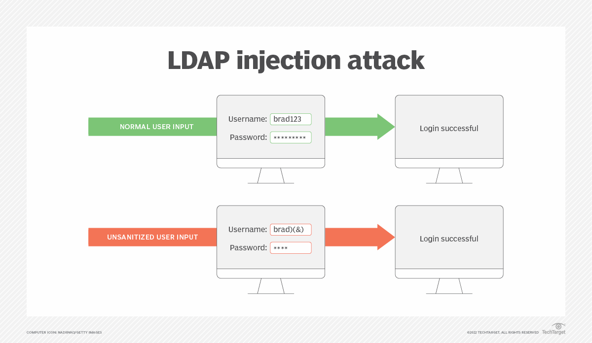

# Ldap injection

What is LDAP injection?
LDAP (Lightweight Directory Access Protocol) injection is a type of security exploit that is used to compromise the authentication process used by some websites. Websites that construct LDAP statements from user data are vulnerable to this type of attack.

Organizations often use LDAP to enable single sign-on and to authenticate users to on-premises and web-based applications. LDAP directories store objects, which include information about these users and the organization's assets. For example, an LDAP directory may contain lists of the different usernames, passwords and email addresses of the users in the organization. If an LDAP directory is used for website authentication, an attacker can enter malicious code into a user input field, gain unauthorized access to the directory, and view or change usernames and passwords.

According to security experts, the main reason that LDAP injection attacks and similar exploits work is because security is often insufficient during the application development process. To protect the integrity of websites that use forms, experts recommend implementing a sanitization process to control the types and number of characters that can be accepted by input boxes as well as using multifactor authentication for public-facing web applications.

How do LDAP injections work?
An LDAP injection attack exploits security loopholes caused by unsanitized user input data. In other words, LDAP injections create malformed queries to gain access in order to potentially change data in a directory. LDAP queries contain special characters such as asterisks, brackets, ampersands and quotes. These characters control the meaning of LDAP queries and dictate the type and number of objects returned by a query. Attackers can alter the query and its intended behavior by modifying these control characters within the query. For example, in a login query that uses LDAP, an attacker can enter the username plus several metacharacters that manipulate the protocol into ignoring the password field.

Using LDAP injection, an attacker can enter the directory to gain access to unauthorized information or modify LDAP statements and content inside the LDAP tree. They can also exploit web applications that create LDAP statements based on user input. Tools that use LDAP include Red Hat Directory Server and Microsoft Active Directory.

Authentication bypass
By inserting the parentheses and extra ampersand, the attacker can bypass access control and login successfully with any password.
What types of LDAP injection attacks are there?
There are several different types of LDAP injection attacks, including the following:

Authentication bypass. On a login page, there are generally two text box fields for a username and password. LDAP normally validates username and password pairs using LDAP filters. To bypass the password validation portion of the process, the attacker can enter a metacharacter -- specifically an ampersand.
Elevation of access privileges. An attacker uses unsanitized user input to gain unauthorized access to information that is reserved for privileged users in the system.
Resource disclosure. The attacker takes advantage of the fact that some objects in the LDAP system are searchable by any user. The attacker searches for a certain object, and under normal circumstances, the directory would return all publicly available results. With the insertion of malicious code, the attacker could manipulate this query to return all objects of that type, both private and public.
Blind attack. Blind LDAP injections work on binary They elicit a true or false response from the server, enabling the attacker to gain information about the contents of the directory. These attacks are slower to implement but are simpler because they just rely on a true or false response. Attackers can test if a certain resource exists or is available -- a user object or a printer, for example. A skilled hacker could use this technique to return more complex values using a mechanism called Booleanization. For example, a hacker could query each value in a string as a true or false question, until the entire string is revealed.
How to prevent LDAP injection attacks
LDAP injection attacks can be used to gain access to sensitive data, change LDAP data or even to take control of a system that uses LDAP. Therefore, it is important to take steps to protect the system from these attacks. Just as with any injection-based attack, the best option for preventing LDAP injection attacks is sanitizing untrusted input and using proper input validation. Application developers should properly encode and sanitize all information in the application layer. Some practices that enable this include the following:

Input validation (allowlisting). Allowlisting involves only accepting input that is known to be good; for example, setting an expected length or numeric range for a given input field.
Escaping all variables. This tells the computer to ignore the special functions of metacharacters -- like ampersands -- that hackers can use to manipulate LDAP input fields. Some querying frameworks escape automatically when building queries -- like LINQtoLDAP, for example.
Indexing fields that contain sensitive information. This increases the number of filters an attacker has to bypass or manipulate to access sensitive information.
Static source code analysis tools. These enable developers to debug an LDAP application before it is running.
Dynamic checks. These enable developers to test and debug an application while it is running.

Developers can also choose to minimize the privileges assigned to LDAP accounts, so if they are compromised, they will have a minimal effect on the overall system. Administrators should also properly configure the LDAP servers and user permissions, especially for mobile and web applications.

What is the difference between SQL injection and LDAP injection?
There are many similarities between LDAP injection and SQL injection. They are both code injection attacks, where the malicious user inserts a piece of their own code into an existing data stream to try to bypass security measures. Code injection can be performed on a variety of different protocols, including Extensible Markup Language, HyperText Markup Language, Structured Query Language (SQL) and LDAP. All of these injection attacks take advantage of scenarios where an application fails to properly sanitize user input.

LDAP injection works in much the same manner as SQL injection, a type of security exploit in which the attacker adds SQL code to a web form. Both types of attacks primarily occur due to missing or weak input validation that does not reject malformed input or strip malicious LDAP control characters before including untrusted user input in a query.

The difference between LDAP and SQL injection is the protocol or language that they exploit, and therefore the syntax of the attack data. LDAP is a protocol for accessing information in directories, whereas SQL is a query language for databases. Therefore, the attacks target different information stores. LDAP injections target directories, whereas SQL injections target databases. LDAP directories are better for storing data that is mostly read, not written. SQL databases are better for dealing with data that is both read and written frequently.

Injection in general, no matter the type, is listed as a top security threat in the Open Web Application Security Project Top 10 list as the third top application security risk of 2021. The recent Log4j security exploit exposed a vulnerability similar to LDAP and SQL injection called a Java Naming and Directory Interface injection.