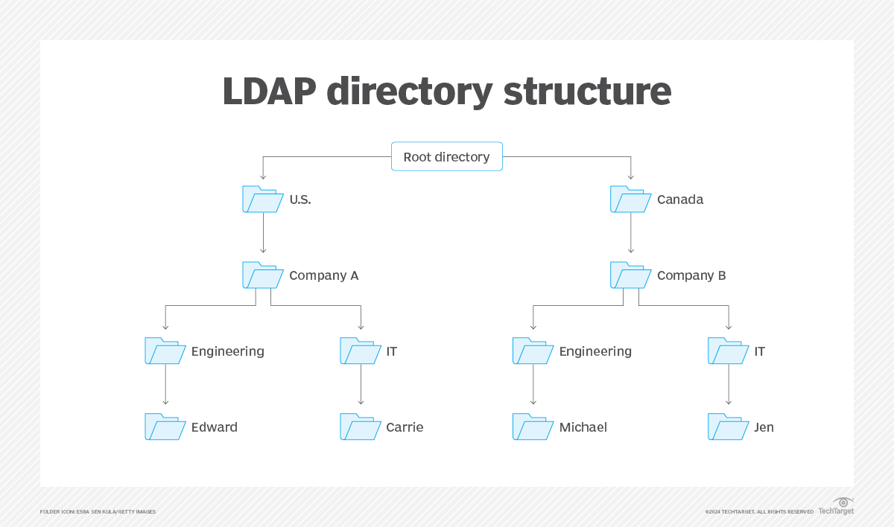

# LDAP
Companies store usernames, passwords, email addresses, printer connections, and other static data within directories. LDAP is an open, vendor-neutral application protocol for accessing and maintaining that data. LDAP can also tackle authentication, so users can sign on just once and access many different files on the server.

LDAP is a protocol, so it doesn't specify how directory programs work. Instead, it's a form of language that allows users to find the information they need very quickly.

LDAP is vender-neutral, so it can be used with a variety of different directory programs. Typically, a directory contains data that is:

Descriptive. Multiple points, such as name and location, come together to define an asset.
Static. The information doesn’t change much, and when it does, the shifts are subtle.
Valuable. Data stored within the directory is critical to core business functions, and it's touched over and over again.
Sometimes, people use LDAP in concert with other systems throughout the workday. For example, your employees may use LDAP to connect with printers or verify passwords. Those employees may then switch to Google for email, which doesn't rely on LDAP at all.

LDAP isn't new. The definitive whitepaper that describes how directory services work and how LDAP should interface was published in 2003. Despite its age, LDAP is still in widespread use today.

The average employee connects with LDAP dozens or even hundreds of times per day. That person may not even know the connection has happened even though the steps to complete a query are intricate and complex.

An LDAP query typically involves:

Session connection. The user connects to the server via an LDAP port. 
Request. The user submits a query, such as an email lookup, to the server. 
Response. The LDAP protocol queries the directory, finds the information, and delivers it to the user. 
Completion. The user disconnects from the LDAP port.

## LDAP vs Active Directory
LDAP and Active Directory are sometimes used interchangeably, but they are not the same thing. Active Directory is a proprietary directory service developed by Microsoft. It can be used for authentication, and/or storing information about network resources. LDAP is one of the protocols that is used to create or query objects in Active Directory.

In a nutshell, LDAP is a language to talk to directory services, and Active Directory is one such directory service.

## Ultimate

### What is LDAP (Lightweight Directory Access Protocol)?

By
Cameron Hashemi-Pour, Site EditorAlexander S. Gillis, Technical Writer and Editor
LDAP (Lightweight Directory Access Protocol) is a software protocol used for locating data about organizations, individuals and other resources, such as files and devices, on public and corporate networks. LDAP is a lightweight version of the Directory Access Protocol that's part of X.500, a standard for directory services in a network. LDAP is considered lightweight because it uses less code than other protocols.

A directory tells the user where in the network something is located. On TCP/IP networks, such as the internet, the domain name system is the directory system used to relate the domain name to a specific network address, which is a unique location on the network. However, users don't always know the domain name. LDAP lets them search for an individual, organization or resource without knowing where it's located, although additional information can help with the search.

This protocol is used in enterprises for accessing and managing data to enable functions such as single sign-on and authenticate users so they can access specific applications. LDAP is useful for locating specific data that must be accessed frequently amidst large amounts of data. Many tech vendors have products that use the LDAP protocol for querying this information.

### How does LDAP work?
There is a multistep process involved in connecting to an LDAP directory and completing a request. It includes the following steps:

1. Establishing a secure connection. A prerequisite to this process is a user installing an LDAP client on their device. This client is required to complete the first step: establishing a secure connection with an LDAP directory using measures such as secure sockets layer or Transport Layer Security for encryption.
2. Submitting a query. The user submits a query to an application, such as an email server or VPN, to perform actions such as looking up an email address or connecting to a printer. The application accesses the LDAP client and sends the user's distinguished name (DN) and password to the LDAP directory server for authentication.
3. Authenticating and authorizing the user. The LDAP directory determines the user has correct credentials, identifies the user group they're assigned to and the operations that group is authorized to perform. Organizations secure the authentication process to prevent attacks such as LDAP injections.
4. Completing the query. The directory returns information to the user, providing the email address requested or the printer connection needed.
Ending the session. The user disconnects from the LDAP directory and the session ends.
Diagram comparing a normal LDAP login to an LDAP injection.

### Uses of LDAP
The most common use of LDAP is to provide a central place for authentication where usernames and passwords are stored. Different applications and services then use LDAP to validate users with a plugin.

For example, LDAP is used to validate usernames and passwords with Docker, Jenkins, Kubernetes, OpenVPN and Linux Samba servers. System administrators also use LDAP single sign-on to control access to an LDAP database.

LDAP can be used to add operations into a directory server database, authenticate or bind sessions, delete LDAP entries, search and compare entries using different commands, modify existing entries, extend entries, abandon requests and unbind operations.

LDAP is used in Microsoft's Active Directory. It's also used in other tools such as OpenLDAP, Red Hat Directory Server and IBM Security Directory Server. 

- OpenLDAP is an open source LDAP application. It's a Windows LDAP client and admin tool developed for LDAP database control:
OpenLDAP lets users browse, look up, remove, create and change data that appears on an LDAP server. It also lets users manage passwords and browse by schema.

- Red Hat Directory Server is a tool used to manage multiple systems with an LDAP server in a Unix environment. It lets users store their details in the server. The tool also provides access control and access management capabilities, such as secure and restricted access to directory data, group membership and remote access, as well as access via validation procedures.

- IBM Security Directory Server is an IBM-based implementation of LDAP. This tool focuses on faster development and distribution of identity control, security and web applications. Security Directory Server includes different validation methods such as validation via digital certificate, Simple Authentication and Security Layer and CRAM-MD5.
If an organization is having trouble deciding when to use LDAP, it should consider the following uses:

- A single piece of data needs to be found and accessed regularly.
- The organization has a lot of smaller data entries.
- The organization wants centralized storage for smaller pieces of data as opposed to decentralized storage, and doesn't require a lot of organization among the data.

### LDAP authentication and authorization
LDAP protocol plays a crucial role in both authentication and authorization so users can complete requests to directories. They are separate yet connected processes. Authentication comes first to establish the credibility of a user, and authorization follows, identifying the search operations the user is authorized to perform.

- Authentication
LDAP authentication begins with a bind operation between the LDAP client and a directory server. The LDAP client securely interacts with the directory using the following steps:

1. An LDAP client requests access to directory information on behalf of a user.
2. The directory requests the user's credentials from the LDAP client, typically in the form of DN and passwords.
3. Once the user information is verified as accurate, the LDAP client retrieves the needed information from the directory.

- Authorization
Once the authentication procedure is complete, authorization follows. Administrators assign users to established groups in an LDAP directory; this is typically done when the users' accounts are created. Each group has a certain level of permissions. 
Once a user is assigned to a group with the permissions needed to make a request, authorization is granted and the user gets access to the information they need.

- Levels of LDAP directory

An LDAP configuration is organized in a simple tree hierarchy consisting of the following levels:

- The root directory. It branches out to countries.
- Countries. These each branch out to organizations.
- Organizations. These branch out to organizational units, such as divisions and departments.
- Organizational units. These branch out to individuals.
- Individuals. These are people, files and shared resources such as printers.
An LDAP directory can be distributed among many servers, which are called Directory System Agents (DSAs). Each server has a replicated version of the total directory that's synchronized periodically. An LDAP server that receives a request from a user takes responsibility for the request, passing it to other DSAs as necessary while ensuring a single coordinated response for the user.

### LDAP and Active Directory
LDAP is the protocol that Microsoft Exchange Server uses to communicate with Active Directory. To understand what LDAP is and what it does, it's important to understand the basic concept behind Active Directory as it relates to Exchange.

Active Directory is a directory service for managing domains, users and distributed resources such as objects for Windows operating systems. A directory service manages domains and objects while controlling which users have access to each resource. Active Directory is available on Windows Server 2022 and is comprised of multiple services. Services included in Active Directory are Domain, Lightweight Directory, Certificate, Federation and Rights Management services. Each service is included under the Active Directory name to expand directory management capabilities.

Active Directory was first previewed in 1999 and has continued to receive updates since then. An update to Windows Server 2016 improved secure Active Directory environments and the ability to migrate Active Directory environments to cloud or hybrid cloud environments.

Active Directory contains information regarding every user account on a network. One key concept within Active Directory is the Active Directory forest. This is the top level in an Active Directory configuration representing an overview of the entire user organization. It's made up of and manages domains that share a common schema. Each user account is treated as an object with multiple attributes. Examples of these attributes are the user's first name, last name and e-mail address. 

LDAP's main job is to extract this information in a usable format.
LDAP uses a relatively simple, string-based query to extract information from Active Directory. It can store and extract objects such as usernames and passwords and share that object data throughout a network. This all happens behind the scenes. An end user will never have to manually perform an LDAP query because Microsoft Outlook is LDAP-enabled and knows how to perform all the necessary queries on its own.