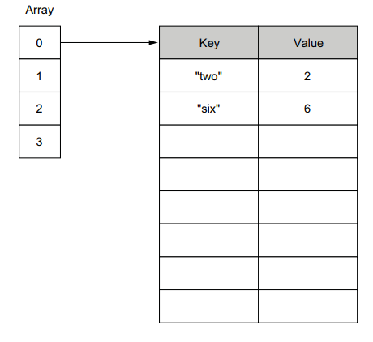

This diagram provides a conceptual understanding of how **maps** work in Go (Golang), specifically focusing on their internal structure. Maps in Go are used to associate keys with values, but under the hood, they rely on hash tables for efficient data storage and retrieval. Let’s break down the key elements in the image:

---

### **Left Side: Array**

- The left side of the diagram represents an **array-like structure**. This is part of the underlying implementation of a hash table in Go maps.
- In Go, maps internally use a hash table, which involves an array where the hash of each key determines the index at which the key-value pair is stored.
- Each index of this array can point to a **bucket** (a group of key-value pairs).

---

### **Right Side: Key-Value Pairs (Buckets)**

- The right side of the diagram represents the **buckets** that store the actual key-value pairs.
- Keys such as `"two"` and `"six"` are shown, along with their corresponding values (`2` and `6`).
- Buckets are used to handle **collisions**. If multiple keys hash to the same array index, they are stored in the same bucket. This helps maintain efficiency and avoids overwriting keys that hash to the same index.

---

### **How it Works**

1. **Key Hashing**:
   - When you insert a key into a map, Go computes a **hash value** for the key.
   - The hash value determines the index in the array (left side) where the corresponding bucket is located.

2. **Storage in Buckets**:
   - The bucket stores the key-value pair. If multiple keys hash to the same index, they are added to the same bucket.

3. **Key Lookup**:
   - When you retrieve a value by its key, Go computes the hash of the key, finds the corresponding bucket using the array index, and then searches the bucket for the exact key.

---

### Example in Go Code

This diagram could represent a map like this in Go:

```go
myMap := map[string]int{
    "two": 2,
    "six": 6,
}
```

- `"two"` and `"six"` are the keys, and `2` and `6` are their associated values.
- Internally, Go hashes these keys and places them in appropriate buckets within the array.

---

### Takeaways

- Maps in Go are backed by hash tables.
- The array (left side) is used to locate buckets, and buckets (right side) store key-value pairs.
- This structure ensures efficient **O(1)** average time complexity for lookups, inserts, and deletions.

This diagram is a simplified view of how Go maps work under the hood. The real implementation is more sophisticated, involving optimizations like growing the hash table when it becomes too full and using advanced algorithms for collision resolution.