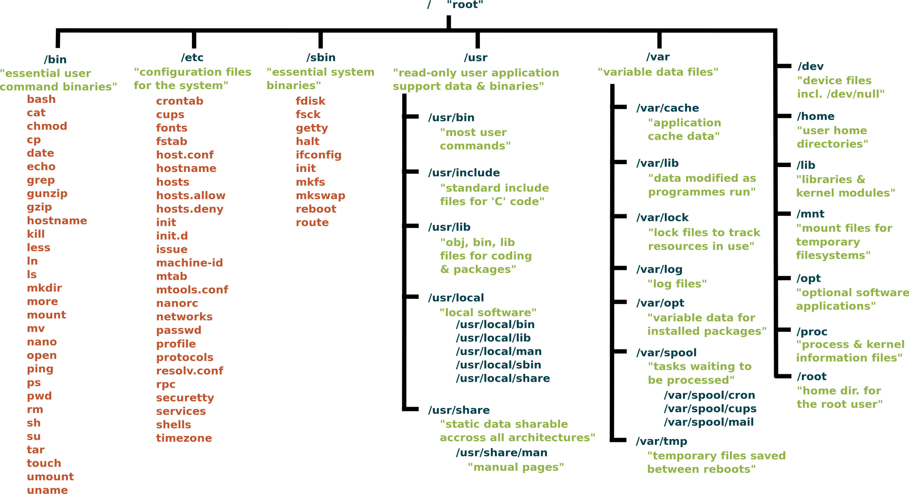

# Directories

## /bin 

(cd /bin).contains executable files (binary files) for important Linux commands. These files are executed whenever we want to use basic Linux commands.

## /sbin

(cd /sbin).similar to the /bin directory and contains command files that only the system administrator can use.

## /boot

(cd /boot). contains the Linux kernel files and system configuration files required to boot the system.

## /dev 

(cd /dev).contains the files for our devices (such as input/output, etc.). The important /dev/null output is located in this directory.

## /etc

(cd /etc). contains important system configuration files that mostly require root access to change.

## /home

(cd /home). contains the home directories of the system's users. Your home directory would be /home/<username>. In general, the address of the home directory for each account is /home/<username>.

## /lib

(cd /lib). contains the libraries required for the /bin and /sbin directories.

## /media

(cd /media). usually contains the contents of external devices such as CDs, Drives, DVDs, etc. to access their files, you need to go into this directory and look for them.

## /mnt

(cd /mnt) usually contains the temporary contents of external devices such as USBs or external hard drives, etc. For example, when you put a USB into your personal system, if you want to access its files, you need to go into this directory and look for them.

## /opt

(cd /opt). is used by software that you install on Linux. For example, if you have worked with the well-known XAMPP software, it uses this directory for its files.

## /proc

(cd /proc). contains some information about the system's resources.
## /root

(cd /root). is the home directory of the root user (or superuser) of your computer.

## /tmp

(cd /tmp). is known as the tmp directory. This directory contains temporary files required by your programs or operating system. In general, programs use this directory to temporarily store some of their data. This directory has a unique feature: every time you restart or turn your device on and off, the contents of this directory are erased. This means that if you need to create a specific file or store temporary data at any time, you can place your files in this directory.

## /usr

(cd /usr). contains information about each user that does not change after installation.

## /var

(cd /var). contains variable data that can be used by many applications.

