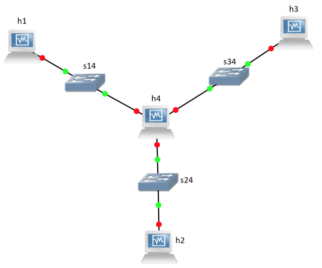
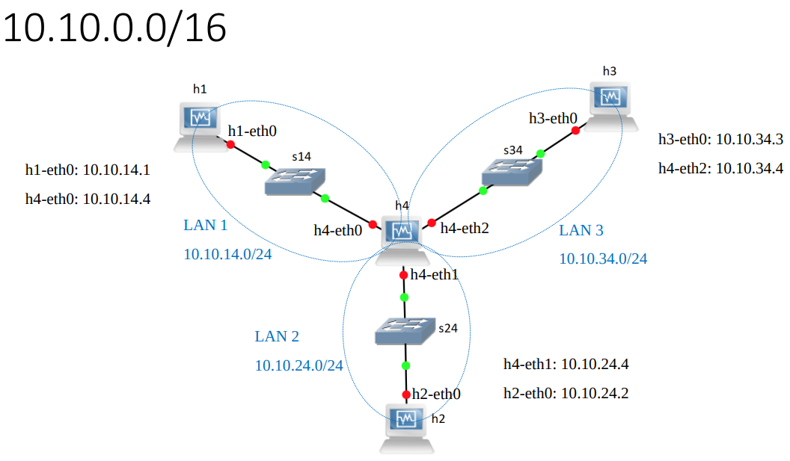

# Lan cofiguration

Show the mode of a host interfaces:
```bash
ip link
```
If an interface mode is DOWN, change it to UP, e.g. h1-eth0:
```bash
ip link set h1-eth0 up
```
>ARP (Address Resolution Protocol)
• A procedure for mapping a dynamic IP address to a physical address,
known as a media access control (MAC) address.
• ARP request
• ARP reply

Show ARP table of a host:
```bash
arp -a
```


## Assign an IP address to an interface
```bash
ip addr flush dev h1-eth0
```
```bash
ip addr add 10.10.14.1/24 dev h1-eth0
```
```bash
ifconfig -a
```
## Set gateway

Show routing table:
```bash
ip route
```
• Add(Delete) default gateway of h1:
```bash
ip route add(del) default via 10.10.14.4
```
## Convert into router
Convert h4 into a router:
```bash
echo 1 > /proc/sys/net/ipv4/ip_forward
```