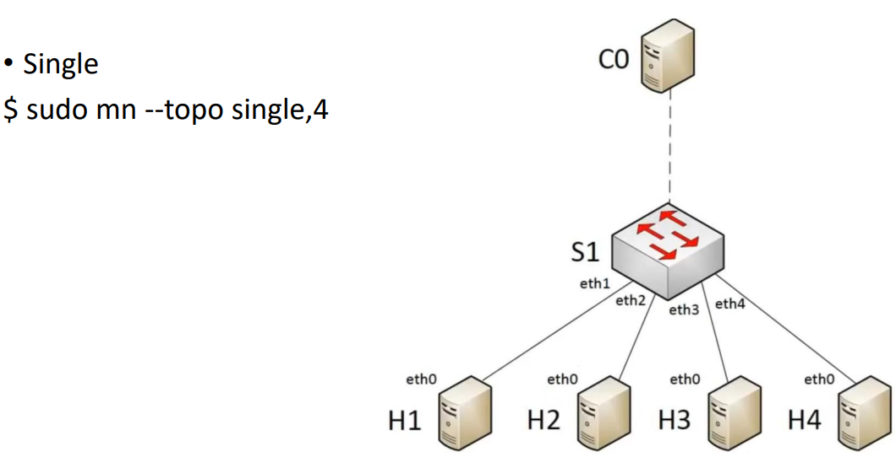
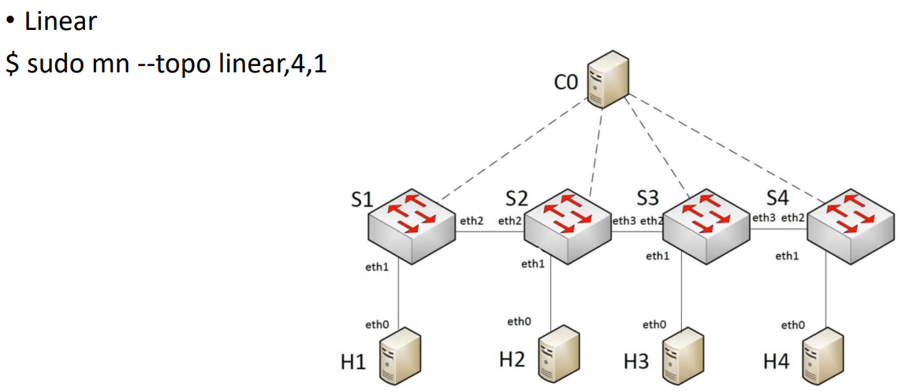
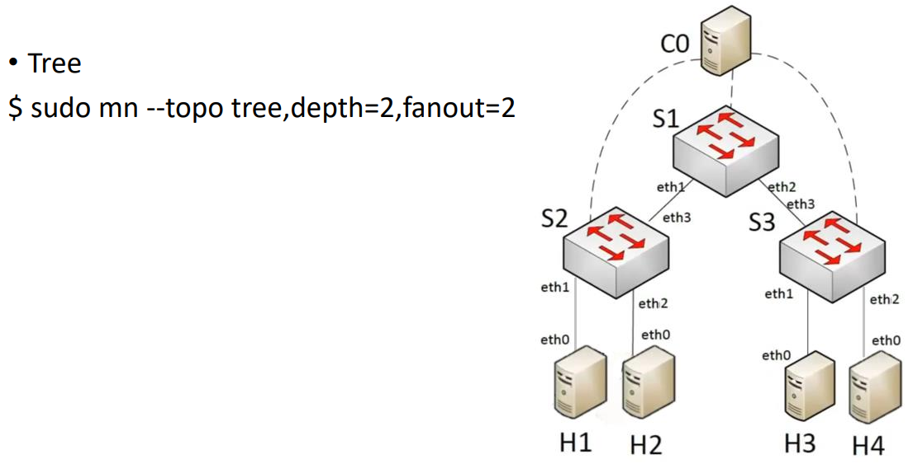

# Mininet

## Start Mininet
with a minimal topology (1 switch and 2 connected hosts).
```bash
sudo mn
```
## Verify the connectivity 
between all pairs of hosts.
```bash
mininet> pingall
```

## Display nodes.
```bash
mininet> nodes
```
## Display links
```bash
mininet> net
```
## Display information 
about all nodes.
```bash
mininet> dump
```
## Exit Mininet
```bash
mininet> exit
```
## Clean up.
```bash
sudo mn -c
```

## Topologies
### single
```bash
sudo mn --topo single,4
```


### linear
```bash
sudo mn --topo linear,4,1
```


### Tree
```bash
sudo mn --tree,depth=2,fanout=2
```


## Commands

• Start Mininet by assigning bandwidth of 100 Mbps and delay of 1 ms to all links.
```bash
sudo mn (--topo …) --link tc,bw=100,delay=1ms
```
• Verify the connectivity by pinging from host h1 to host h2.
```bash
mininet> h1 ping h2 -c 10
```
• Perform a TCP bandwidth test between hosts h1 and h2
```bash
mininet> iperf h1 h2
```