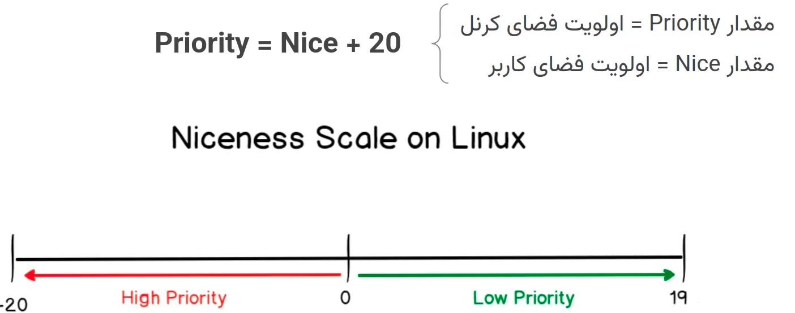

# Processes

* processes 
```bash
/proc
```
* retrieve of a running process with specific name
```bash
ps -x | grep "cat$" | grep "S\+" | awk '{print$1}' | tail -n 1
# OR
pgrep cat$ | tail -n 1
```
* specific process with <pid> 
```bash
/proc/<pid>
```
* name of the process
```bash
cat /proc/<pid>/cmdline
```
* state 
```bash
cat /proc/<pid>/status | grep State
```
* execute of the process
```bash
/proc/<pid>/exe << EOF
'DATA'
EOF
```
* Standard stream
```bash
ls /proc/<pid>/fd
# output : 0 1 2 => stdin stdout stderr
```
* write to input
```bash
echo "Data" > /proc/<pid>/fd/0
```

## OS
- name of OS
```bash
uname <option>
```
- option
- -s : name of kernel
- -v : version of kernel
- -r : release of kernel
- -a : all system info


## list processes
```bash
top # top consuming
htop # top consuming more human
ps aux
```
### Output
- **PID Column**: Unique identifier for each process.
- **USER Column**: The user running the process (note that the process's permissions are limited to those of this user).
- **PRI Column**: Process priority in the kernel.
- **NI Column**: User-space priority of the process (commonly known as Niceness). default = 0
- **VIRT Column** (equivalent to VSZ in the `ps` command): The amount of memory requested by the process (the entire amount might not be used by the process).
- **RES Column** (equivalent to RSS in the `ps` command): The amount of memory currently used by the process.
- **SHR Column**: The amount of shared memory used by the process.
- **S Column**: The current state of the process.
- **%CPU Column**: The percentage of CPU usage by the process.
- **%MEM Column**: The percentage of memory usage by the process.
- **+TIME Column**: The elapsed time since the process started.
- **Command Column**: The command of the process.


## Example Commands
### Display Specific Columns
To display the process ID, user, CPU usage, and command:

```bash
ps -e -o pid,user,%cpu,cmd
```
### options
- -s <column> : sort by column
- -u <user>   : belong to <user>

### Interaction

| Key  | Operation |
|------|-----------|
| F9   | Kill a process |
| F8   | Increase Nice value by one unit (requires `sudo` if running `htop`) |
| F7   | Decrease Nice value by one unit (requires `sudo` if running `htop`) |
| F6   | Sort processes by the selected column |
| F5   | Display processes in a tree format |
| F4   | Filter processes by name |
| F3   | Search for a process |
| F2   | Settings |
| F1   | Help |


## Control
- watch current shell processses
```bash
jobs 
```
- transfer process to background
```bash
bg JOB <syntax suger>
```
- run process in background
```bash
<command> &
```
- transfer process to foreground
```bash
fg JOB
```

##  Process status


### status

* R => Running or Runnable
* D => Uninterruptible Sleep
* S => Interruptable Sleep
* T => Stopped
* Z => Zombie
* *+ => forground

**PROCESS STATE CODES**
>Here are the different values that the s, stat and state output
>specifiers (header "STAT" or "S") will display to describe the state of a process:

D  ***  uninterruptible sleep (usually IO)
I  ***  Idle kernel thread
R  ***  running or runnable (on run queue)
S  ***  interruptible sleep (waiting for an event to complete)
T  ***  stopped by job control signal
t  ***  stopped by debugger during the tracing
W  ***  paging (not valid since the 2.6.xx kernel)
X  ***  dead (should never be seen)
Z  ***  defunct ("zombie") process, terminated but not reaped by its parent

### ps
```bash
  ps -[option]
```
- -a – show processes for all users.
- -u – more infos like resource usage, process owner etc. .
- -o – custom output format, specified columns
- -x – include processes dont have controlling terminal.
- -e/-A – list all processes in the system, regardless of the owner or controlling terminal or current shell. 
- -H – formats the CMD column’s data to display the parent-child relationship between processes.
- -T – tree structered
- -axjf – prettier output with a few more columns.
- -p <pid>
- -r : only running processes
- -f : output in long format(more info)
- -e : running processes

- Sorting
```bash
ps --sort [+|-]<column>
```
- **USER Column**: The user running the process (note that the process's permissions are limited to those of this user).
- **PID Column**: Unique identifier for each process.
- **%CPU Column**: The percentage of CPU usage by the process.
- **%MEM Column**: The percentage of memory usage by the process.
- **VSZ Column** (equivalent to VIRT in the `htop` command): The amount of memory used in bytes.
- **RSS Column** (equivalent to RES in the `htop` command): The amount of RAM used in kilobytes.
- **TTY Column**: The type of terminal in use.
- **STAT Column**: The state of each process.
- **START Column**: The time the process started.
- **TIME Column**: The amount of time the process has been running.
- **COMMAND Column**: The command of the process.


| Column   | Description                                                |
|----------|------------------------------------------------------------|
| **PID**  | Process ID.                                                |
| **PPID** | Parent Process ID.                                         |
| **UID**  | User ID of the process owner.                              |
| **USER** | Username of the process owner.                             |
| **RUSER**| Real user name.                                            |
| **GROUP**| Group name of the process owner.                           |
| **TTY**  | Terminal associated with the process.                      |
| **TIME** | Cumulative CPU time used by the process.                   |
| **CMD**  | Command that started the process.                          |
| **COMM** | Command name (only the executable name).                   |
| **ARGS** | Command with all its arguments.                            |
| **STAT** | Process state (e.g., R, S, D, Z, T) with additional characters for more details. |
| **VSZ**  | Virtual memory size of the process.                        |
| **RSS**  | Resident Set Size (the non-swapped physical memory a task has used). |
| **%CPU** | CPU usage percentage.                                      |
| **%MEM** | Memory usage percentage.                                   |
| **NI**   | Nice value of the process (used for priority).             |
| **PRI**  | Priority of the process.                                   |
| **STIME**| Start time of the process.                                 |
| **WCHAN**| If a process is sleeping, this is the name of the kernel function in which it is sleeping. |


**Interruptible Sleep (S State):**
- In the S state, a process is waiting for an event to complete.
- It can return to the running ® state either by receiving a signal or through an explicit wake-up call.
- When a process in the S state receives a signal, the error returned is EINTR.
- Common examples of S state processes include those waiting for I/O operations (e.g., reading from a file).

In the D state, a process is also waiting for an event (e.g., disk I/O) to complete.
Unlike S state, processes in the D state ignore signals.
They require an explicit wake-up call to transition back to the R state.
For instance, creating a folder with mkdir typically results in uninterruptible sleep.

| Interruptible Sleep (S State)  | Operation |
|------|-----------|
| F9   | Kill a process |
| F8   | Increase Nice value by one unit (requires `sudo` if running `htop`) |
| F7   | Decrease Nice value by one unit (requires `sudo` if running `htop`) |
| F6   | Sort processes by the selected column |
| F5   | Display processes in a tree format |
| F4   | Filter processes by name |
| F3   | Search for a process |
| F2   | Settings |
| F1   | Help |


  
- processes with specific name
```bash
ps -aux | grep <process name>
```
- more info about ids
```bash
ps xao uid,pid,ppid,pgid,sid,cmd
```
- **UID Column**: The user ID running the process (note that the process's permissions are limited to those of this user).
- **PID Column**: Unique identifier for each process.
- **PPID Column**: The parent process ID.
- **PGID Column**: The process group ID.
- **SID Column**: The session ID.


- finds the PID of a process by its name.
```bash
pidof -[option] <processname>
```


- -c – ensures that only PIDs from the current root directory are returned.
- -o – omits the specified PIDs from the results.
- -s – returns only a single PID, typically the oldest, among the matching processes.


```bash 
pgrep [options] pattern
```
- Options
- -l – List the process names and the PIDs.
- -n – returns only the newest instance among the matching processes. 
- -o – returns only the oldest instance among the matching processes.
- -u – matches processes that the specified user owns.
- -x – Only find processes that exactly match the given pattern.

- DESCRIPTION
> pgrep looks through the  currently  running  processes  and  lists  the
>process IDs which match the selection criteria to stdout.  All the cri‐
>teria have to match.  For example,
```bash
      $ pgrep -u root sshd
```
> will only list the processes called sshd AND owned  by  root.   On  the
> other hand,
```bash
      $ pgrep -u root,daemon
```
> will list the processes owned by root OR daemon.
> pkill  will  send  the  specified  signal  (by default SIGTERM) to each
>process instead of listing them on stdout.
>pidwait will wait for each process instead of listing them on stdout.


- finds the PID of a process by its name.
```bash
pidof -[option] <processname>
```
- -c – ensures that only PIDs from the current root directory are returned.
- -o – omits the specified PIDs from the results.
- -s – returns only a single PID, typically the oldest, among the matching processes.


- find the executable file for a command
```bash
which <executable file>
```

## Memory
- memory
```bash
free -mt # m : megabyte, t : total
```


## Priority

nice : kernel space priority = range -20 -- 19 
priority : user space priority = nice + 20 

niceness between -20 to 0 = high, 1 to 19

- run command/process with priority
```bash
nice -n <nice_value> <command>
```

only root can create process with niceness -20 to 0 

- change priority
```bash
renice -n <nice_value> -p <pid>
renice -n <nice_value> -u <user>
```

## Signal

- **SIGINT Signal**: The default action of this signal is to terminate the process. This signal can be sent to a process using the Ctrl+c shortcut.
- **SIGKILL Signal**: The default action of this signal is to terminate the process. Unlike SIGINT, the SIGKILL signal cannot be ignored or its behavior changed.
- **SIGSTOP Signal**: The default action of this signal is to stop the process. This signal can be sent to a process using the Ctrl+z shortcut.
- **SIGCONT Signal**: The default action of this signal is to continue the execution of a stopped process.

- SIGTERM (15) – this is the default and safest way to kill a running process in Linux. It allows the process to terminate gracefully.can be achived also by Ctr+c.
- SIGKILL (9) – this signal immediately stops any primary or background process without allowing it to clean up.can be achived also by Ctr+z.
- SIGSTOP (19) – pauses a current process without terminating it.can be achived also by Ctr+z.
- SIGHUP (1) – this signal reports that the user’s terminal is disconnected, often leading to the process’s termination.
- SIGINT (2) – this signal interrupts a process, typically sent from the keyboard shortcut Ctrl+C.
- SIGCONT (18) – continue the process
* SIGKILL & SIGSTOP effects immediately


### Kill

- All signals
```bash
kill -l
# KILL , STOP, CONT
```

- send signal to process
```bash
kill -NAME <PID>
# or
kill -NUMBER <PID>
# ex
kill -SIGSTOP <PID>
```

- kill multiple
```bash
kill <pid1> <pid2> ...
```

- kill with pattern
```bash
kill $(pgrep pattern)
```

#### pkill
- kill all the processes containing the process name <pname>
```bash
pkill <pname> [option]
```
- -u [username] – kills processes owned by a specific user.
- -t [terminal] – kills processes attached to a specific terminal.
- -l – provides a detailed process list along with the PID.
- -n – Only kill the newest of the processes that are discovered.
- -o – Only kill the oldest of the processes that are discovered.
- -x – Only kill the processes that match the pattern exactly.
- --signal – Send a specific signal to the process, rather than SIGTERM.
- -e, --echo – Display name and PID of the process being killed.  (pkill only.)
- -x – match exactly
  
#### xkill
- closes a given server's connection to clients. The syntax of the xkill command is;
If a server has opened some unwanted processes, xkill aborts these processes.
```bash
xkill <resource>
```

#### killall

- kill/terminate all processes named <pname>
```bash
killall <pname> [option]
```

- kill group or session
```bash
kill -SIGNAL -<PGID>
kill -SIGNAL -<SID>
```
- -e – This option specifies that the process name should match exactly. If this option is not used, "killall" will match any process name that contains the specified string.
- -I – ignore case for matching name
- -i – This option prompts the user before killing each process.
- -s <signal> – This option allows you to specify a common signal to send to the background process. The default signal is SIGTERM.
- -I – Ignore the case when trying to find the process name.
- -u – Only kill processes owned by a specific user.
- -v – Report back on whether the process has been successfully killed.
- -o [time] – only kills processes older than the specified time.
- -y [time] – only kills processes newer than the specified time.
- -q – do not complain if no processes were killed
- -r(--regexp)/-f – interpret process name as regex pattern
- -v – report if a signal was successfully sent

- Ex: terminates all currently running processes named chrome that have been running for longer than 30 minutes:
```bash
killall -o 30m chrome
```


## Groups & Sessions

- **Group**: A group is a set of related processes that can be sent signals all at once. Each group is identified by a <PGID>.
- **Group Leader**: In a group, the process whose <ID> equals the <group ID> is the group leader (<PID> == <PGID>).
- **Session**: Each tab in your terminal is considered a session, and each session can have multiple process groups. The `jobs` command shows the processes in the session where the command is executed, which is why the output of `jobs` differs across different terminal tabs. Each session is identified by an <SID>.
- **Session Leader**: Within a session, the process whose <ID> equals the <session ID> is considered the session leader (<PID> == <<SID>>). When you bring a process to the foreground with the `fg` command, that process (and its corresponding process group) becomes the session leader.


## init process
after booting:
```bash
ps -aux | head -n 2
```

## Daemon processes

* background system processes
* their parents is init process
* end with d
```bash
ps -ef | awk '$3 == 1'
```

## Process cycle

[Process cycle in shell](Process%20cycle%20in%20shell.png)