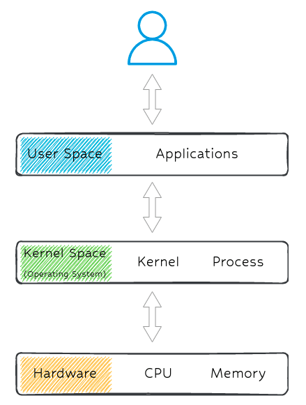
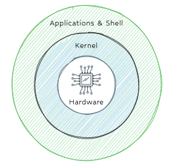

# Linux System

## [Directories.md](./Directories.md)
- service and processes most using cpu

## [Permissions.md](./Permissions.md)
- Users & Permissions

## [Update](./Update.md)

## [Processes](./Processes.md)

### Kernel

## [Services](./Services.md)

