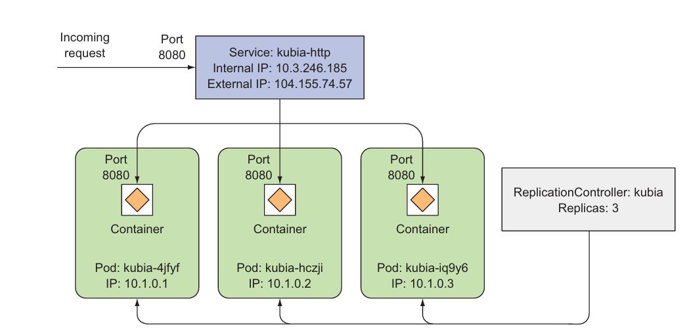
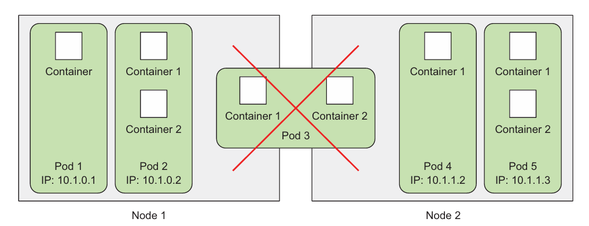
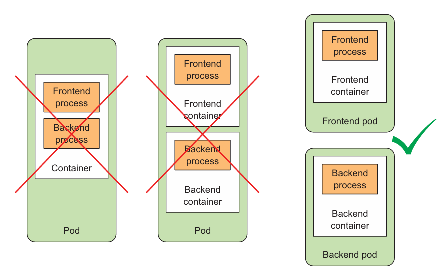

- inspect info about the node a pod is assigned to
```bash
kubctl get pods -o wide
```

- gui dashboard

```bash
kubectl cluster-info | grep dashboard
```
- credentials for GKE dashboard
```bash
gcloud container clusters describe <cluster name> | grep -E "(username|password):"
```

- dashboard in minikube
```bash
minikube dashboar
```


## Pods
> logical hosts and behave
much like physical hosts or VMs in the non-container world. Processes running in the
same pod are like processes running on the same physical or virtual machine, except
that each process is encapsulated in a container.



> why multiple containers are better than one container running multiple processes ?

containers are designed to run only a single process per container. 
if multiple unrelated processes are run, it would be our responsibility to keep all those processes running, manage their logs and ... .
e.g. we have to include a mechanism for automatically restarting individual processes if they crash. also those would log to the same stdout, making it complicated to distinguish them.
 
- definition
> A pod of containers allows you to run closely related processes together and provide them with (almost) the same environment as if they were all running in a single
container, while keeping them somewhat isolated. This way, you get the best of both
worlds. You can take advantage of all the features containers provide, while at the
same time giving the processes the illusion of running together.

`pods act as an higher level abstraction to provide you with necessary infrastructure for running and managing co-related processes withing a same simulated environment`

- isolation

Docker to have all containers of a pod share the same set of Linux namespaces
instead of each container having its own set. 
	
* same hostname
* same network interfacees
* same ip and port space (port conflicts arise for processes within containers in the same pod)
* same loopback address (containers within the same pod can communicate with eachother through localhost)
* same IPC, PID namespace
since filesystem of a container is dependent on its image, containers are isolated from each other when dealing with filesystem

### flat inter-pod network
all pods in a cluster reside in a single flat, shared, nat-less network-address space (like computers on a LAN)
- this is achieved through an additional software-defined network layered on top of the actual network

### organizing containers across pods 
Instead of stuffing every
thing into a single pod, you should organize apps into multiple pods, where each one
contains only tightly related components or processes
- utilizing resources most efficiently
> If both the frontend and backend are in the same pod, then both will always be
run on the same machine. If you have a two-node Kubernetes cluster and only this sin
gle pod, you’ll only be using a single worker node and not taking advantage of the
computational resources (CPU and memory) you have at your disposal on the second
node. Splitting the pod into two would allow Kubernetes to schedule the frontend to
one node and the backend to the other node, thereby improving the utilization of
your infrastructure.
- individual scaling
>  A pod is
also the basic unit of scaling. Kubernetes can’t horizontally scale individual contain
ers; instead, it scales whole pods. If your pod consists of a frontend and a backend con
tainer, when you scale up the number of instances of the pod to, let’s say, two, you end
up with two frontend containers and two backend containers. 
 Usually, frontend components have completely different scaling requirements
than the backends, so we tend to scale them individually. Not to mention the fact that
backends such as databases are usually much harder to scale compared to (stateless)
frontend web servers. 
### when use multiple containers in a pod
> the app consists of one main process and one or more complementary processes (sidecar container) 

e.g. a web server as main and a sidecar container that periodically downloads content from an external source and stores it in the web server's dir or log rotators, collectors, data processords, and ... .

ask these questions for your decision 
- are they required to run together or can they run on different hosts?
- do they represent a single whole or are they independent components?
- must they be scaled together or individually?
